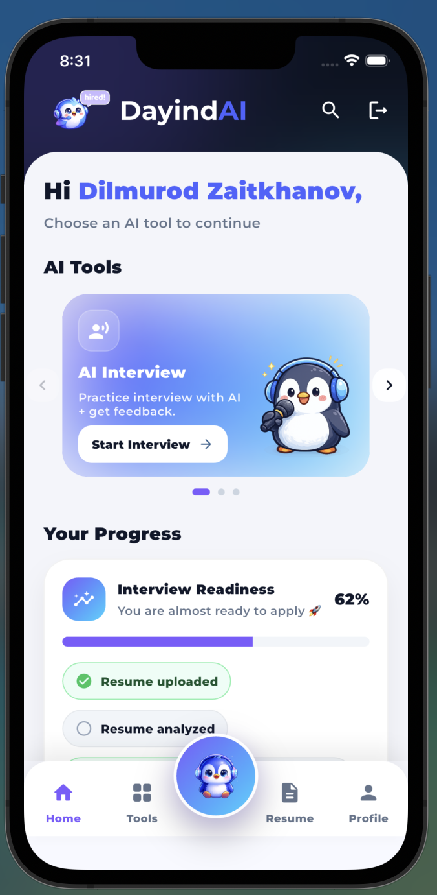
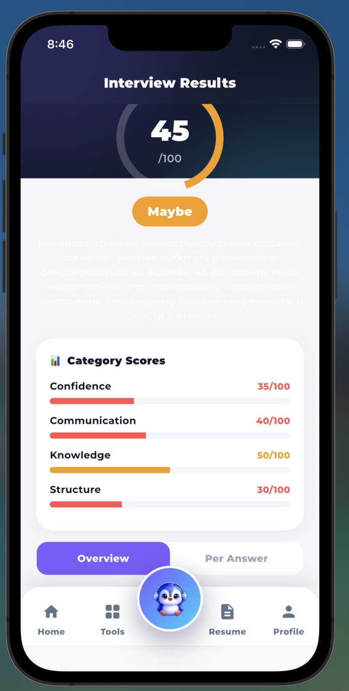
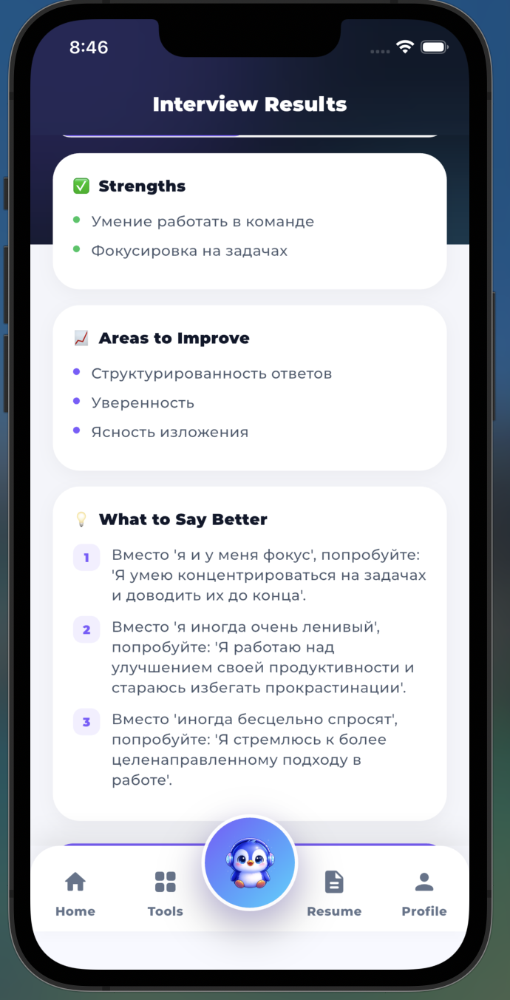
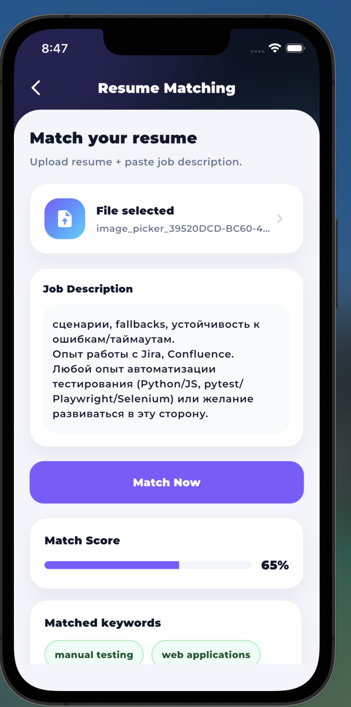
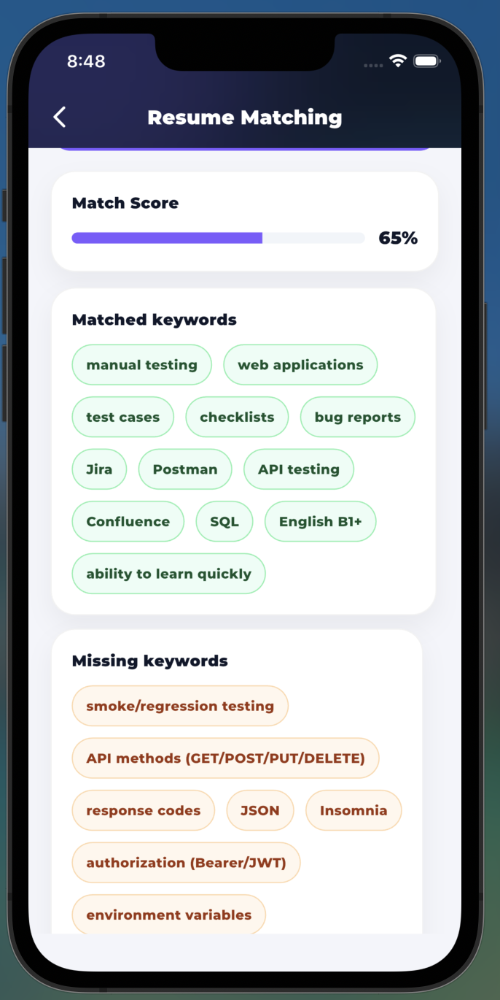
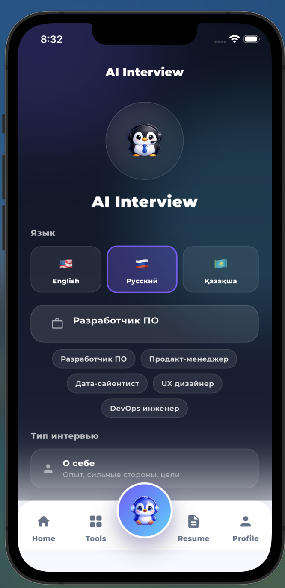
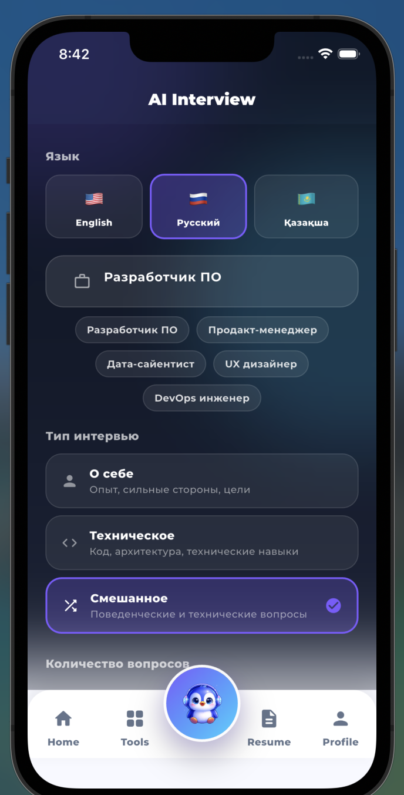

🚀 DayindAI — AI-Powered Career Preparation App

DayindAI is a Flutter-based mobile application designed to help users improve their resumes and prepare for job applications using AI-driven analysis.

The project demonstrates integration of modern AI services into a scalable mobile architecture with secure backend processing.

  

  

  
  

  
  

  
  

📱 Implemented Features

✅ Resume Analyzer
	•	AI-powered resume evaluation
	•	Resume scoring
	•	Strengths & weaknesses detection
	•	Personalized improvement recommendations

✅ Resume Matching
	•	Resume-to-job description comparison
	•	Match score (0–100%)
	•	Matched keywords detection
	•	Missing skills analysis
	•	Actionable improvement suggestions

⸻

🚧 In Progress
	•	AI Mock Interview (voice + transcript mode)
	•	Interview performance scoring
	•	Realtime voice interview (Premium feature)
	•	Subscription model integration

⸻

🏗 Architecture

The application follows a clean and scalable architecture:
	•	Flutter (UI Layer)
	•	Provider (State Management)
	•	Service Layer abstraction
	•	Firebase Cloud Functions v2 (Node.js backend)
	•	Secure AI API integration via server-side functions
	•	Separation of UI and business logic

⸻

🛠 Technology Stack
	•	Flutter & Dart
	•	Firebase (Cloud Functions)
	•	REST API integration
	•	DeepSeek AI API
	•	Google Vision OCR
	•	Provider

⸻

🎯 Project Goal

To build an AI-powered mobile assistant that:
	•	Improves resume quality
	•	Increases job application success rate
	•	Simulates realistic interview experiences
	•	Provides structured AI-based feedback

⸻

📌 Current Status

Fully implemented and working:
	•	Resume Analyzer
	•	Resume Matching

AI Interview module is currently under development.

⸻

👨‍💻 Author

Dilmurod Zaitkhanov
Flutter Developer (Intern)